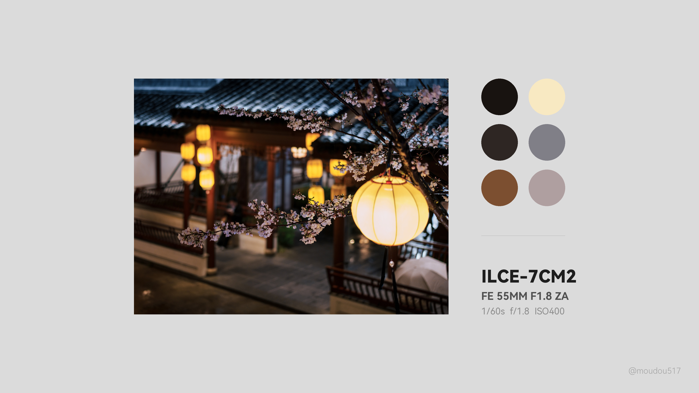

# 📸 Minimal Photo Poster Generator

这是一个为摄影师设计的自动化海报生成工具，支持根据照片比例自动切换布局。

## ✨ 核心特性

* **智能布局自适应**：自动识别横竖构图。
    * **横版**：采用 **3x2 大圆几何对称排布**，视觉重心极其平衡。
    * **竖版**：采用侧边长条色块对齐，追求极致的极简主义。
* **色调提取与排序**：基于 HSL 算法对主色调进行排序，确保色彩过渡自然。
* **参数自动化**：深度适配 **Sony ILCE-7CM2 (A7C2)** 元数据展示，自动读取 EXIF 信息。
* **高精度对齐**：所有文字基于 Baseline 对齐，确保边缘严丝合缝，无视觉毛刺。

## 🖼️ 效果预览 (Demo)

| 横版布局 (Landscape - 3x2 对称) | 竖版布局 (Portrait - 极简侧边) |
| :--- | :--- |
|  |  |

> *样片说明：以上展示了针对 Sony A7C2 拍摄的城市景观进行的排版优化。*

## 🚀 快速开始

1. **克隆项目**：
   ```bash
   git clone [https://github.com/moudou517/Minimal-Photo-Poster.git](https://github.com/moudou517/Minimal-Photo-Poster.git)
   cd Minimal-Photo-Poster
