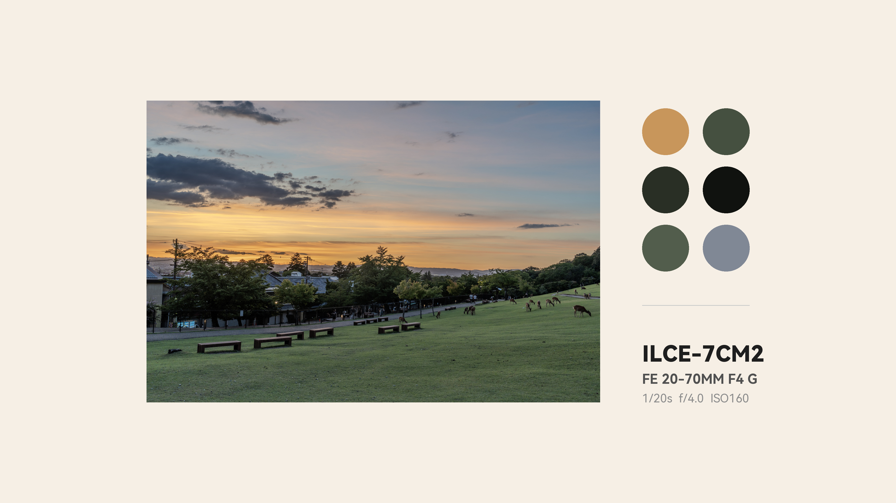
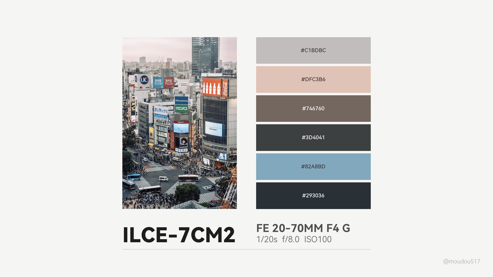

# 📸 Minimal Photo Poster Generator

这是一个为摄影师设计的自动化海报生成工具，支持根据照片比例自动切换布局，并追求极致的排版美学。

## ✨ 核心特性

* **智能布局自适应**：自动识别横竖构图，应用不同的几何对齐策略。
    * **横版 (Landscape)**：采用 **2x3 圆形矩阵排布**。引入**几何切线偏移逻辑**，确保色块视觉重心与照片顶边达成完美的比例关联，避免视觉“冒头”。
    * **竖版 (Portrait)**：采用 **2x3 矩形矩阵排布**。支持**空间感知取色**，使色块排列顺序与照片内容的物理分布（上、中、下）逻辑对应。
* **空间感知色调提取**：不再是全局随机抓取颜色，而是将照片划分为顶、中、底三个区域进行采样，确保海报色块能够“讲述”照片的空间色彩构思。
* **参数自动化**：深度适配 **Sony ILCE-7CM2 (A7C2)** 及镜头元数据展示，自动解析并规范化 EXIF 信息[cite: 4]。
* **高精度对齐系统**：所有元素基于动态坐标计算。横版色块与文字区通过自动伸缩的分割线连接，确保视觉呼吸感随内容动态平衡。

## 🛠️ 技术细节

### 1. 几何切线对齐 (Geometry Alignment)
在横版布局中，我们解决了圆形色块容易产生视觉偏移的问题。通过设置 `origin_y = img_y + radius + offset`，使第一个色块在与照片顶边相切的基础上向下偏移 $1/3$ 半径，从而在视觉上压住重心，达成几何层面的严丝合缝。

### 2. 空间采样算法 (Spatial Sampling)
竖版布局启用区域化 KMeans 聚类。我们将图像垂直划分为三段：
1. **Top Zone** (0-33%) -> 提取 2 个颜色对应矩阵第一行。
2. **Middle Zone** (33-66%) -> 提取 2 个颜色对应矩阵第二行。
3. **Bottom Zone** (66-100%) -> 提取 2 个颜色对应矩阵第三行。

## 🖼️ 效果预览 (Demo)

| 横版布局 (2x3 几何切线对齐) | 竖版布局 (2x3 空间感知矩阵) |
| :--- | :--- |
|  |  |

> *样片说明：以上展示了针对 Sony A7C2 拍摄的城市景观（东京、大阪）进行的排版优化[cite: 4]。*

## 🚀 快速开始

1. **克隆项目**：
   ```bash
   git clone [https://github.com/moudou517/Minimal-Photo-Poster.git](https://github.com/moudou517/Minimal-Photo-Poster.git)
   cd Minimal-Photo-Poster
